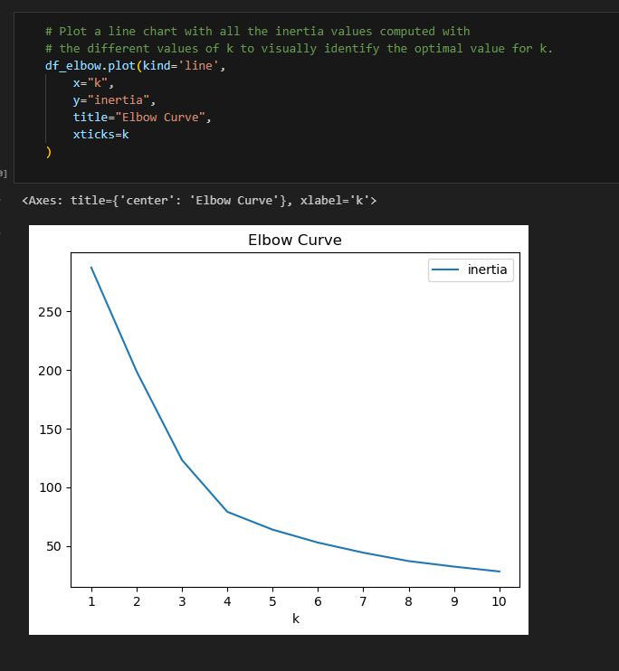
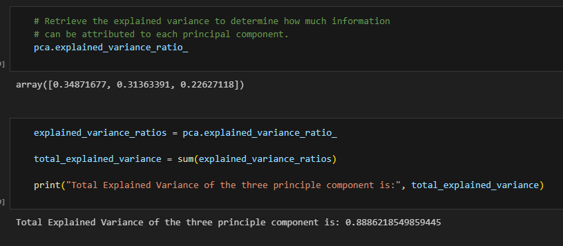
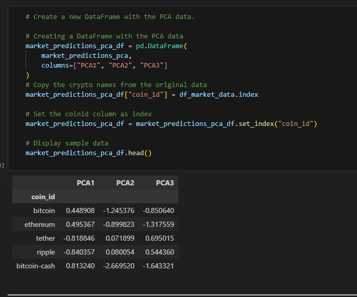
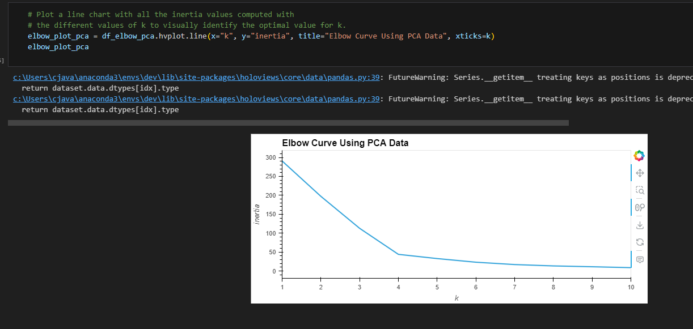
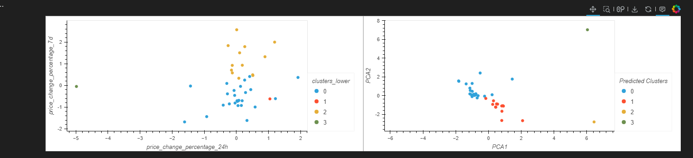

# CryptoClustering

# Summary:

This project involves using Python and unsupervised learning to predict if cryptocurrencies are affected by 24-hour or 7-day price changes. After preparing the data, including normalization and PCA, the analysis includes finding the optimal number of clusters using the elbow method and then clustering the cryptocurrencies using K-means. Finally, the results are visualized and compared to understand the impact of using fewer features in clustering.

# What is the best value for K?

Based on the elbow curve it is 4. 

# What is the total explained variance of the three principal components?

The total explained variance is:  0.8886218549859445

# Dataframe with PCA data:

# What is the best value for K using the PCA Data?

The best value is 4. 

# After visually analyzing the cluster analysis results, what is the impact of using fewer features to cluster the data using K-Means?

After analyzing the cluster analysis results, we determine that we can use less features and get a similar performance to the original model, since we can clearly identify 4 clusters. Also, having a reduced number of columns makes it easier to visualize the value of the clustering.

# File Information:

The final code file is enclosed in the "Starter Code" folder. The final code file is titled "Crypto_Clustering". 

Please Note: The graphs/charts do not show up when viewing the code in Github. You must load the code into VS Code to view the charts and graphs. 
